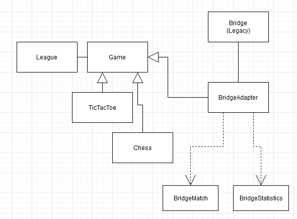
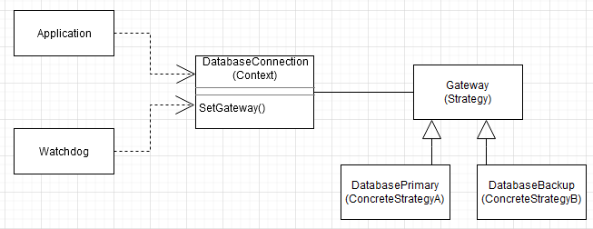

# Reuse Exercises
## 8-1
Consider the ARENA object design model. For each of the following objects, indicate if it is an application object or a solution object:
* League
  - Application object
    - Describes an object which is part of the application domain
* LeagueStore
  - Solution object
    - Describes how to (generally) handle the storage of application domain objects. This is part of the solution domain, and is described as an interface.
* LeagueXMLStoreImplementor
  - Solution object
    - tecnical implementation
* Match
  - Application object
    - General description
* MatchView
  - Solution object
    - specific implementation
* Move
  - Application object
    - general contract
* ChessMove
  - Solution object
    - specific implementation

## 8-2
Indicate which occurrences of the following inheritance relationships are specification inheritance and which are implementation inheritance:
* A Rectangle class inherits from a Polygon class.
  - specification
* A Set class inherits from a BinaryTree class.
  - implementation
* A Set class inherits from a Bag class (a Bag is defined as an unordered collection).
  - specification
* A Player class inherits from a User class.
  - implementation
* A Window class inherits from a Polygon class.
  - specification

## 8-3
Consider  an  existing  game  of  bridge  written  in  Java.  We  are  interested  in integrating this bridge game into ARENA. Which design pattern would you use?  
  - Adapter  

Draw a UML class diagram relating the ARENA objects with some of the classes you would expect to find in the bridge game
- adapter added to the diagram on page 341.
- BirdgeMatch and BridgeStatistics implements Match and Statistics respectively (page 343)

## 8-4
Consider a workflow system supporting software developers. The system enables managers to model the process the developers should follow in terms of activities and work products. The manager can assign specific processes to each developer and set deadlines for the delivery of each work product. The system supports several types of work products, including formatted text, picture, and URLs.  The manager, while editing the workflow, can dynamically set the type of each work product at run time.  
Assuming one of your design goals is to design the system so that more work product types can be added in the future, which design pattern would you use to represent work products?
- Composite
  * This pattern encapsulates hierarchies by providing a common superclass for aggregate and leaf nodes
  * New types of leaves can be added without modifying existing code.

## 8-5
Consider a system that includes a database client and two redundant database servers.  
Both database servers are identical: the first acts as a main server, the second acts as a hot back-up in case the main server fails. The  database client accesses the servers through a single component called a “gateway,” hence hiding from the client which server is currently being used. A separate policy object called a “watchdog” monitors the requests and responses of the main server and, depending on the responses, tells the gateway whether to switch over to the back-up server.  
What do you call this design pattern?  
- Strategy-pattern
  - Policy and mechanisms should be decoupled
  - Must allow different algorithms to be interchanged at runtime
  - Page 326

Draw a UML class diagram to justify your choice.

## 8-6
In Section 8.4.1, we used a Bridge pattern to decouple the implementation of the ARENA LeagueStore subsystem   from   its   interface,   enabling   us   to   provide   different implementations for the purpose of testing. Ideally, we would apply the Bridge pattern to each subsystem in our system design to facilitate testing.  
Unfortunately, this is not always possible.  
Give an example of a subsystem where the Bridge pattern cannot be used.
 - none come to mind

## 8-7
Consider  the  following  design  goals.  Indicate  the  candidate  pattern(s)  you  would
consider to satisfy each goal: 
* Given a legacy banking application, encapsulate the existing business logic component.
* Given a chess program, enable future developers to substitute the planning algorithm that decides on the next move with a better one.
* Given a chess program, enable a monitoring component to switch planning algorithms at runtime, based on the op posing player’s style and response time.
* Given a simulation of a mouse solving a maze, enable the path evaluation component to evaluate different paths independently of the types of moves considered by the mouse.

## 8-8
Consider an application that must select dynamically an encryption algorithm based on security requirements and computing time constraints. Which design pattern would you select? Draw a UML class diagram depicting the classes in the pattern and justify your choice 
