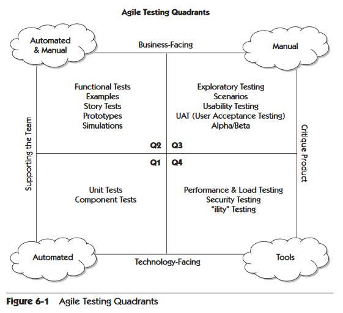

# Testing recap
Eksamens træningsopgaver til næste gang.

## 1. Hvad er Unit-testing og hvilket formål er der ved at bruge det?
- Unittest tester isolerede stykker af kode, typisk på funktions-niveau. 
- Hvis der ligger noget logik inden i en propertys get/set så vil dette også blive testet med en Unittest.
  - Testene skal være hurtige
  - der bør være flest af disse
  - man bruger typisk mock-data

### Hvordan tester man API?
- Integration test
  - Her er der fokus på den samlede applikation
    - Skal dække vigtige "cross-module" processer
  - kan bruges til at opdage uventede fejl
- Brug eventuelt postman eller fiddler
- Man kan lave automatiske test med `WebApplicationFactory<>()`
  - Her kan man stadig mocke udvalgte dependencies.

### Hvordan tester man Database?
- Integration test
- InMemory database eller rigtig database der indeholder testdata, det vil sige ikke produktionsserver
- Testmiljø som spejler produktionsmiljøet

### Hvad er Fluent Assertions og hvilke fordele/ulemper har FA?
- et framework ovenpå mstest eller xunit
- har et mere læsevenligt flow
  - variabel should be....
- har nogle beskrivende beskeder når tests fejler - som inkluderer hele fejlscopet, ikke kun linjen med fejlen
  - Klare fejlbeskeder gør det nemmere at rette fejl!
  
  Ulemper:
  - En ny dependency
  - nyt framework man skal lære

### Hvad er TDD og BDD?
Samspil mellem TDD og BDD

#### TDD
- Test Driven Development => red, gren , refactor
  - Skriv en test der fejler
  - skriv koden som får testen til at kunne gennemføre
  - refactor
- TDD ligger op til at man laver simple designs (der er nemme at teste) og som giver udvikleren selvtillid (både til at koden er iorden, men også til at kunne ændre i koden)

#### BDD
- Behavior Driven Development => forretningsfolk skriver testene (i Gherkin), udviklerne skriver testene som er understøttet af 
  - Skal skabe større samarbejde mellem forretningsfolk, QA og udviklere.
  - formatet beskriver eksempler som danner basis for den kommende kode
  - beskriver kun adfærd - der må ikke være nogle detaljer om UI
- I BDD bruges ofte:
  - Scenarios
    - Overordnet beskrivelse af situationen
  - Given
    - Udgangspunktet ved starten af scenarie
  - When
    - Det event som starter scenariet
  - Then
    - Det forventede udfald af scenariet

## 2. Hvilke principper kan man med fordel bruge ifm. udvikling i kode for at det bliver testbart?
SOLID:  
- Single Responsibility
  - Der må kun være en grund til at tilstanden i klassen ændrer sig.
  - klasser skal have begrænset ansvar i applikationen
  - En klasse har kun et ansvar
- Open-Closed
  - Open for extension, closed for modification
  - Decorator pattern
  - Extension metoder til typer
- Liskov substitution
  - Subtyper kan gå i stedet for en supertype
    - interface => supertypen
    - implementering => subtyper
- Interface Segregation
  - Hvis alle metoderne i et interface ikke giver mening at implementere i den konkrete klasse, så bør man opdele i flere interfaces
- Dependency Inversion
  - en klasse må ikke afhænge af konkrete implementeringer, men i stedet på abstrationer 
    - abstraktion => interface / abstrakt klasse
  
Dependency Injection:  
- delegerer ansvaret for instantiering væk fra klassen som har den afhængighed
- afhængigheden bliver resolved i runtime

Clean Architecture/"onion architecture" giver nogle gode udgangspunkter så projektets struktur understøtter tests på forskellige niveauer.

### Fremvis eksempel på et princip
Dependency Inversion:
- MakersOfDenmark.Application.Commands.Validators.AddressValidator  
    - => vi er her afhængige af det generelle interface (IHaveAddress.cs), ikke den specifikke implementering (EditMakerSpaceAddress.cs og RegisterMakerSpace.cs)
    - Dette er også et eksempel på __LSP__

### Hvordan kan man bruge Chaos engineering ifm. test af kode?
Chaos Engineering ligger i Q4, det vil sige:  "med fokus på teknologi" og "Kritiserer produktet".
- Man undersøger hvor robust (resiliens) et system er, ved at udsætte det for nogle forskellige forhold.

Chaos Engineering tester typisk:
- Infrastructure
- Netværk
- Applikation

Ved at skabe edge cases, såsom at miste en harddisk, cpuens load øgest til max, services lukker ned.

## 3. Hvad er BDD?
Se længere oppe  
Behavioral Driven Development - beskrivelse af brugsscenarier / arbejdsflows

### Hvordan bidrager BDD til udviklingen?
Se længere oppe => Udviklere og forretningsfolk skriver usecases sammen
- Skal støtte samarbejdet mellem udviklere og forretningsfolk
  - Udviklere og forretningsfolk har ens forståelse af forretningen
  - I en unittest som er baseret på en usecase hvor det kun er udviklernes forståelse der testes
- skal give eksempler som kan bruges i udviklingen
- dokumenterer brugsscenarier
- skrives af en forretningsperson eller eksempelvis en Product Owner
- Automatisering foregår eksempelvis med SpecFlow

### Hvordan opbygger man en testplan
Se på de krav og behov der er beskrevet. Brug Agile Testing Quadrants som inspiration til at afdække relevante områder, på tværs af de 4 beskrevne dimensioner.

- Indsamling af krav
- Teststrategi:
  - Scope
  - Typer
  - Risici
  - test-logistics
- Testkriterier
  - Flowdiagrammer
- Resource Planning:
  - Hardware
  - Medarbejdere
  - Økonomi! :)
- Test deliverables:
  - build pipelines (automatiseret)
  - grafik visning

### Forklar Maricks test kvadrant og giv eksempler på test man kan udføre i hver kvadrant
Der er 4 dimensioner over to akser
 - Business Facing / Technology Facing
 - Supporting the Team / Critique Product

Hver kvadrant dækker 2 dimensioner

