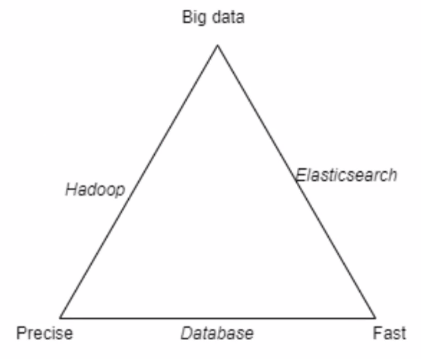

# Elastic Search Talk
By: Mikkel Busch, Bizzkit (Hesehus)
- Making Web shops

## Elastic Search
- Distributed near real time semi structured search
- Designed for scalability based on Lucene
- Used in some very common websites (wikipedia search)

## It is NOT a database
- no ACID properties
- Dont use it as your primary storage

## Basic concepts
- documents => indexes => nodes => clusters
- document is a record, has a unique id and is stored as JSON
- Index is a logital namespace, that tells where data is stored in the cluster
- ... (more in slide)
- HTTP based REST API, return JSON

## Inverted Index
- the structure enables fast and effective test search
- text is broken into tokens

## Searches
- The relevance of your search results defines the success of your webshop
- people can't buy what they can't find

## Stemming
- Reducing words to its core using language specific rules

## Stopwords
- Some words are just noise
- So we just remove them

## Synonyms
- "Sokker" = "strømper" should return the same results

## Fuzziness
- Dont use it.
- Allowing spelling errors

## Phrase suggester (Did you mean?)
- based on edit distance
- frequency of term in population

## Type as you search

## Aggregations
- This is not search results, but data aggregated on top of search results
- Search filters
  - show number of "red" results
- Aggregation types
  - Metric
    - min/max/avg
  - Bucket
    - "group by"
  - Pipeline
    - chain aggregations making aggregations on top of other aggregations.

## Logging
- Elastic Search can be used as more than a search engine
  - Log-aggregations for reporting

